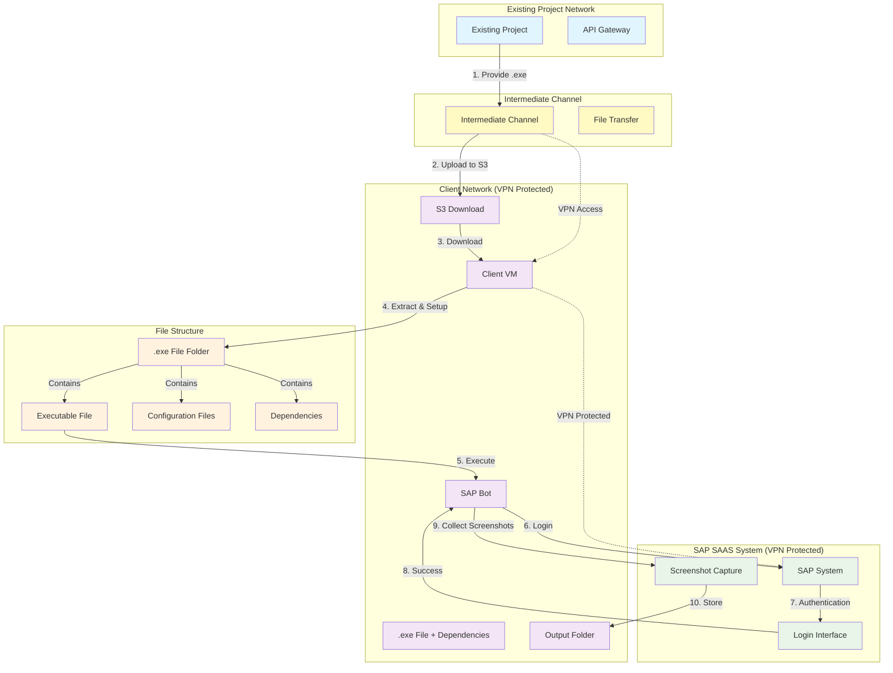
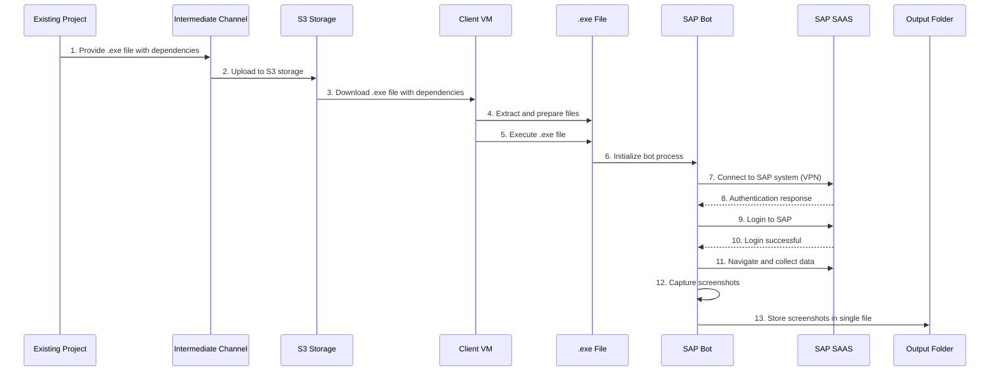
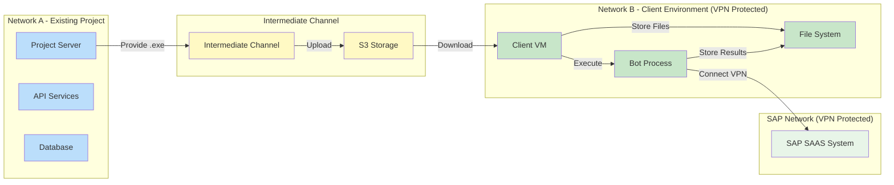

# System Architecture Diagram

## Tech Stack

### Frontend/Client Technologies
- **Client VM**: Windows/Linux Virtual Machine
- **Bot Framework**: Python/Node.js for SAP automation
- **Screenshot Capture**: Selenium WebDriver, Puppeteer, or similar automation tools
- **File Processing**: Native OS file system operations

### Backend/Server Technologies
- **Existing Project**: REST API (Node.js/Python/Java)
- **API Gateway**: AWS API Gateway, Kong, or similar
- **Database**: PostgreSQL/MySQL/MongoDB for project data

### Cloud & Storage
- **S3 Storage**: AWS S3 for .exe file and dependencies storage
- **Cloud Provider**: AWS/Azure/GCP
- **File Transfer**: AWS CLI, SDK, or custom upload/download scripts

### Network & Security
- **VPN**: OpenVPN, WireGuard, or enterprise VPN solution
- **Network Security**: Firewall rules, VPC configuration
- **Authentication**: OAuth 2.0, JWT tokens, or enterprise SSO

### SAP Integration
- **SAP System**: SAP S/4HANA Cloud (SAAS)
- **SAP Automation**: SAP GUI Scripting, SAP RFC, or UI automation
- **Authentication**: SAP Single Sign-On (SSO) or basic authentication

### Monitoring & Logging
- **Logging**: ELK Stack (Elasticsearch, Logstash, Kibana) or CloudWatch
- **Monitoring**: Prometheus, Grafana, or cloud monitoring solutions
- **Error Tracking**: Sentry or similar error tracking service

### DevOps & Deployment
- **Containerization**: Docker (optional for bot deployment)
- **CI/CD**: GitHub Actions, GitLab CI, or Jenkins
- **Infrastructure**: Terraform or CloudFormation for IaC
- **Version Control**: Git

## Network Integration and SAP Bot Feature

## Process Flow Diagram

## Network Topology Diagram

### 1.1 Business Objectives
- Automate SAP screenshot collection process
- Integrate cloud storage for output file management
- Enhance security through centralized file storage
- Reduce manual intervention in the file handling process
- Maintain compatibility with existing Windows-based systems

---

## 2. Business Context

### 2.1 Current State
- Existing Autonomous Config project operates in a network environment
- Manual .exe file upload process through intermediate channel
- Output files stored locally on client VM
- Windows-based execution environment
- VPN-protected client network

### 2.2 Desired Future State
- Automated output file upload to cloud storage
- Centralized file management and access
- Enhanced security through cloud storage integration
- Streamlined file retrieval process
